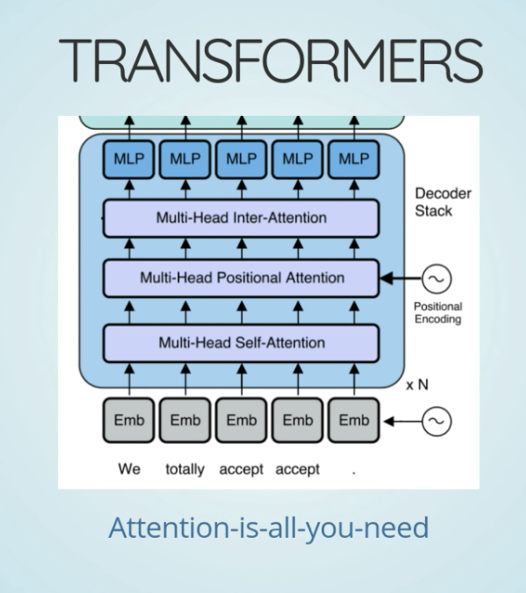

* traditional DL that beat TFIDF

* word2vec embeddings. embeddings learnt unsupervised manner

* LSTM can't exploit GPU parallelization they way CNN does

* New in DL NLP-

* Dealing with out of vocabulary words-
  * https://github.com/google/sentencepiece
  * https://www.aclweb.org/anthology/D18-2012.pdf
  * 
* Attention is all you need. CNN based method
  * 
* Language models
  * Like embeddings, now train entire model on huge text corpus. Idea is to capture good context
  * Trains both model and embeddings in **unsupervised way**
  * All this can be done for free (unsupervised) and captures a lot of useful information
  * 
* Fine Tuning. Made popular by fast.ai
  * 
  * 
* BERT
  * successor to ELMo
  * 
  * Full of transformers
  * 
  * SQUAD is QA task
  * imageNet moment for NLP. Allows amazing transfer learning
  * Beat others by huge margins. See the original paper of BERT
  * Large BERT is mainly for TPU size.
  * Expensive to train from scratch
  * 
  * 
