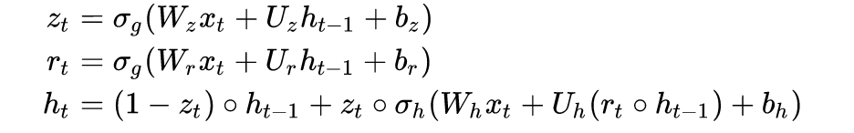
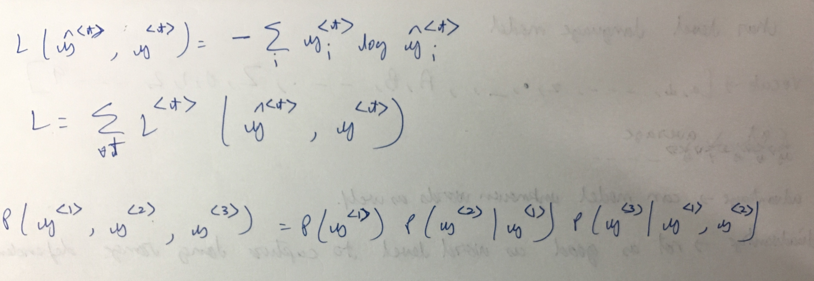
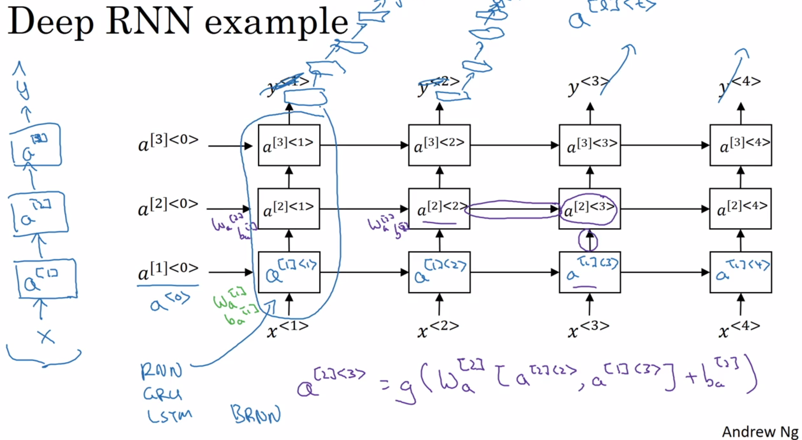

* RNN

* Suppose the next time step’s output depends on context many time steps before. RNN have difficulty in this. Theoretical explanation-
http://ai.dinfo.unifi.it/paolo//ps/tnn-94-gradient.pdf
* Practical Eg -
  * Below picture y<t> = 1 if x<t> is a proper noun.

This is the loss for 1 example->

* GRU is simpler, faster, often better
* LSTM is more powerful, flexible
  * C -> cell state, the highway connection
  * a, also called h- hidden state. The softmax at output is not present by default in keras. Keras gives a(t)/h(t) as output
  * 
  * LSTM original paper
    http://web.eecs.utk.edu/~itamar/courses/ECE-692/Bobby_paper1.pdf
  * good - http://colah.github.io/posts/2015-08-Understanding-LSTMs/
  * LSTMs are explicitly designed to avoid the long-term dependency problem. Remembering information for long periods of time is practically their default behavior, not something they struggle to learn!
  * Instead of having a single neural network layer (as in vanilla RNN), there are four, interacting in a very special way.
  * A NN layer is being referred here as linear combination of signal with some weights followed by some activation function.
  * 
  * The key to LSTMs is the cell state, the horizontal line running through the top of the diagram.
  * The cell state is kind of like a conveyor belt. It runs straight down the entire chain, with only some minor linear interactions. It’s very easy for information to just flow along it unchanged. (similar idea like ResNet)
  * The LSTM does have the ability to remove or add information to the cell state, carefully regulated by structures called gates.
  * Gates are a way to optionally let information through. They are composed out of a sigmoid neural net layer and a pointwise multiplication operation.
  * The sigmoid layer outputs numbers between zero and one, describing how much of each component should be let through. A value of zero means “let nothing through,” while a value of one means “let everything through!”  
  * An LSTM has three of these gates, to protect and control the cell state.
    1. forget gate layer.  . decides which values of C<t-1> to keep
    2. update gate layer Γu. decides which states to update.
    3. tanh layer creates a vector of new candidate values. C̅<t>
    4. C<t> - new candidate values scaled by how much we decided to update each state value.
    5. Γo . decides what parts of the cell state we’re going to output
    6.  a<t> = tanh(C<t>) * Γo.   purpose of tanh(c<t>) is to squash c<t> between -1 and 1. a<t> is filtered version of c<t>.
    7. y<t>= softmax(a<t>) -> output function varies based on application
  * Peephole paper- ftp://ftp.idsia.ch/pub/juergen/TimeCount-IJCNN2000.pdf
  * GRU - (notation from  http://colah.github.io/posts/2015-08-Understanding-LSTMs/ )
    * 
    * 

  many extensions to LSTM now

1. recurrent nets that time and count
2. couple i/p and forget gates
3. GRU
4. Depth Gated RNNs by Yao, et al. (2015).
5. Clockwork RNNs by Koutnik, et al. (2014).
6. Greff, et al. (2015) do a nice comparison of popular variants, finding that they’re all about the same
7. Jozefowicz, et al. (2015) tested more than ten thousand RNN architectures, finding some that worked better than LSTMs on certain tasks.

What after LSTM? attention. The idea is to let every step of an RNN pick information to look at from some larger collection of information. if you are using an RNN to create a caption describing an image, it might pick a part of the image to look at for every word it outputs. Xu, et al. (2015)
Grid LSTMs by Kalchbrenner, et al. (2015) . Work using RNNs in generative models – such as Gregor, et al. (2015), Chung, et al. (2015), or Bayer & Osendorfer (2015) – also seems very interesting. Lot more to come !
In addition to the original authors, a lot of people contributed to the modern LSTM. A non-comprehensive list is: Felix Gers, Fred Cummins, Santiago Fernandez, Justin Bayer, Daan Wierstra, Julian Togelius, Faustian Gomez, Matteo Gagliolo, and Alex Graves.


* Language modeling-
  * used in speech recognition, machine translation etc. Output things which are likely
  * 
  * Once language model is trained, we can sample from it. <Shakespeare like text generation>
  * Sampling from language model
  * Let first output y (hat)<1> be generated. Feed it into next block of RNN. And keep doing it
  * Stop if you get <EOS>. If <EOS> not in dictionary, sample say 50-100 words. You might also get <UNK> words. You have option to keep or discard them.
  * 
  * 
  * 

^ The above joint probability is calculated on a new sentence given a trained NN. Each probability term is simply output of RNN at diff time steps.
Corollary- (redundant point)The above model can also be used to predict "following next word" given set of words.

The above is word level language model. Next we will see char level language model
* 
Word level used more often

Exploding gradients- use gradient clipping
Vanishing gradients in RNN- Can’t capture long time step dependencies. Solution- better architectures.

Bidirectional RNN with LSTM/GRU blocks is common

Disadvantage of Bidirectional RNN - needs entire sentence to start doing processing. So for speech recognition, it would need entire sentence to start doing inference. Speech recognition uses more advanced techniques
* 
Deeper RNN
* 
